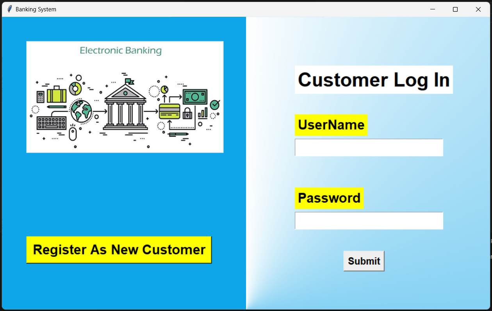

# Bank Tkinter: A Simple GUI Banking System
---

## Overview
The Bank Tkinter project is a simple graphical user interface (GUI) application built using Python's Tkinter library. It simulates a basic banking system, allowing users to create accounts, deposit and withdraw funds, and view their account balances.

## Features
- **Account Creation**: Users can create new accounts with unique account numbers.
- **Deposit and Withdrawal**: Users can deposit and withdraw funds from their accounts.
- **Account Balance**: Users can view their current account balance.

## Requirements
- Python 3.x
- Tkinter library
- MySQL

## Installation
1. Clone this repository using the command `git clone https://github.com/RushikeshSonwane03/Bank_Tkinter.git`.
2. Navigate to the cloned repository using `cd Bank_Tkinter`.
3. Install the required Python packages using `pip install -r requirements.txt` (if you have a `requirements.txt` file).
4. Run the application using `python main.py`.

## Usage
1. Run the application using `python main.py`.
2. The application will display a GUI with two options Register New User and login option (for Existing User).
   - Login Credentials: || Username - admin  || password - @123 ||
4. Next Screen will display options to deposit, withdraw, view the balance and Close Account.
5. Select the desired option and follow the prompts to perform the action.

## Contributing
Contributions are welcome. If you'd like to contribute, please fork this repository and create a pull request with your changes.

## Contact
If you have any questions or need further assistance, please feel free to reach out to me at [rushikeshsonwane03@gmail.com](mailto:rushikeshsonwane03@gmail.com).

---

## Screenshots

| Banking System            |
|-----------------------------|
|  |

| Login Screen                | Account Creation            |
|-----------------------------|-----------------------------|
|  |  |

| Deposit                     | Withdrawal                  |
|-----------------------------|-----------------------------|
|  |  |

| Database Schema             |
|-----------------------------|
|  |

--- 

## Credits
- Rushikesh Sonwane 

---

## Connect with me  

  

  
  

   
